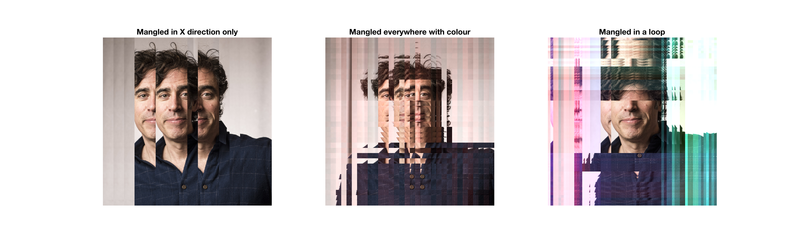
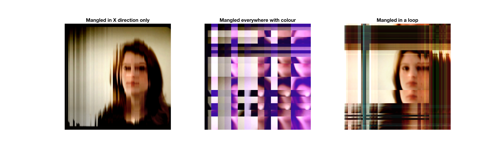

# faceMangle

A MATLAB script with helper functions to mangle your face all haxxor style.

## License

Creative Commons Zero 1.0, do as you will!

## Usage

There are two modes: `all` and `direction`. Selecting `all` will apply the mangling everywhere, whereas `direction` increases in mangling over the specified dimension.

For `all` there are 2 parameters:
  - `nBlocks`, which must be a power of 2.
  - `maxOffset`, which controls how far a given block can move from it's original position.

The offset of each block is then determined using a uniform distribution limited by `maxOffset`.

For `direction` there is an additional parameter, `power`. The higher the number, the more the amount of mangling will change over the image. A negative power will simply flip the direction (I know, not a strict power law, but this is more functional).

## Limitations

- The image must be square because of the way the function creates blocks.
- The image format must be a matrix of `uint8` and dimensions NxNx3.
- The size of the image must be a power of two.

## Examples: Mangled Stephen Mangan

(image used without permission)

### To mangle only in the X direction:

    mangledX = imageMangle(Iscaled, 2^4, 4, [0;0;0], 'direction', -1, 0);

### To add random colour and mangle everywhere

    % Colours add a bit of colour to a block dependent on how much it is moved.
    % Set to [0; 0; 0] for no added colour.
    addColours = {[12; 3; 3];...
                  [5; 3; 12];...
                  [32; 3; 3];...
                  [12; 3; 32];...
                  [12; 31; 3];...
                  [12; 50; 50]};

    nColours = length(addColours);

    mangledAll = imageMangle(Iscaled, 2^5, 2, addColours{floor(nColours*rand(1))+1}, 'all');

### To repeatedly mangle with increasingly smaller blocks

    % Loop through big to small block sizes
    mangledLoop = Iscaled;

    % Low numbers here mean big blocks, high numbers mean small blocks
    blockRange = min(3:6, minP2);
    nSteps = length(blockRange);

    power = 4;

    maxOffset = floor(linspace(4,2,nSteps));

    for nn=1:nSteps
        % Mangle over a direction.
        mangledLoop = imageMangle(mangledLoop, 2^blockRange(nn), maxOffset(nn), addColours{floor(nColours*rand(1))+1}, 'direction', -power, power);
        mangledLoop = imageMangle(mangledLoop, 2^blockRange(nn), maxOffset(nn), addColours{floor(nColours*rand(1))+1}, 'direction', power, -power);
    end

# Creative commons photos

A couple of images are included from Flickr for testing purposes.

## [Cabinet card photo](https://www.flickr.com/photos/144957155@N06/39051726134/in/photolist-22uSiD1-gh85XG-TJG1BA-8YUpFP-3JrHDq-RBh4JA-fuLAXM-ABQCG-5gFjn-mJ6pA9-7TKZeT-75tND-9uK4W4-ayET7i-62TUgH-bqn6bU-G7mWMB-aDoSXt-apfiLx-7h8rgJ-amknrm-94MgZ-7BXBPH-3cMopf-ePunyv-eodiPW-aQBP6-6fARSf-9viDsA-dCQZ8v-fHFoz3-8xRnfy-24ptYNz-FFhyni-3s3SSu-Tu1TrA-dh1hae-6ejkBf-nqpk4R-o5ki-NBPmf-9LR5fu-Vy9b-7zYUFQ-3YMoHr-B8mMg-f5JE9r-5JgAJ2-X5LSpt-dk8T86) by Midnight Believer (Public Domain)

## [liz4](https://www.flickr.com/photos/elephipelephi/391753384/in/photolist-ABQCG-5gFjn-mJ6pA9-7TKZeT-75tND-9uK4W4-ayET7i-62TUgH-bqn6bU-G7mWMB-aDoSXt-apfiLx-7h8rgJ-amknrm-94MgZ-7BXBPH-3cMopf-ePunyv-eodiPW-aQBP6-6fARSf-9viDsA-dCQZ8v-fHFoz3-8xRnfy-24ptYNz-FFhyni-3s3SSu-Tu1TrA-dh1hae-6ejkBf-nqpk4R-o5ki-NBPmf-9LR5fu-Vy9b-7zYUFQ-3YMoHr-B8mMg-f5JE9r-5JgAJ2-X5LSpt-dk8T86-8CEwPw-5xCDN5-78PMt-Lfpab-jJFqf3-bmPzC9-S1quw) by Patty M. (CC BY-NC 2.0)

